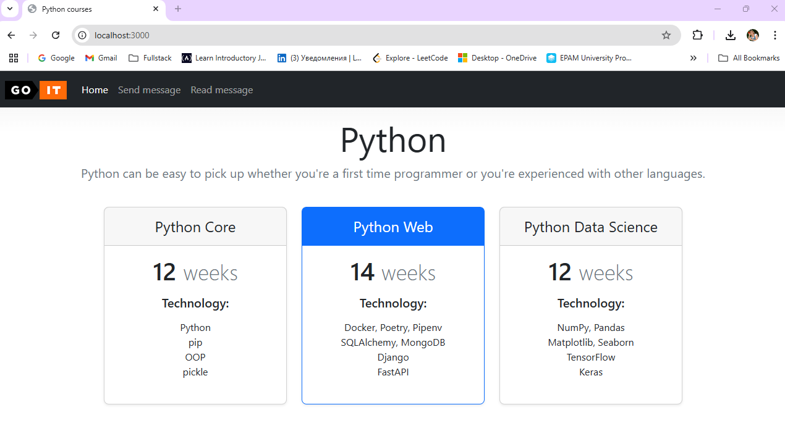
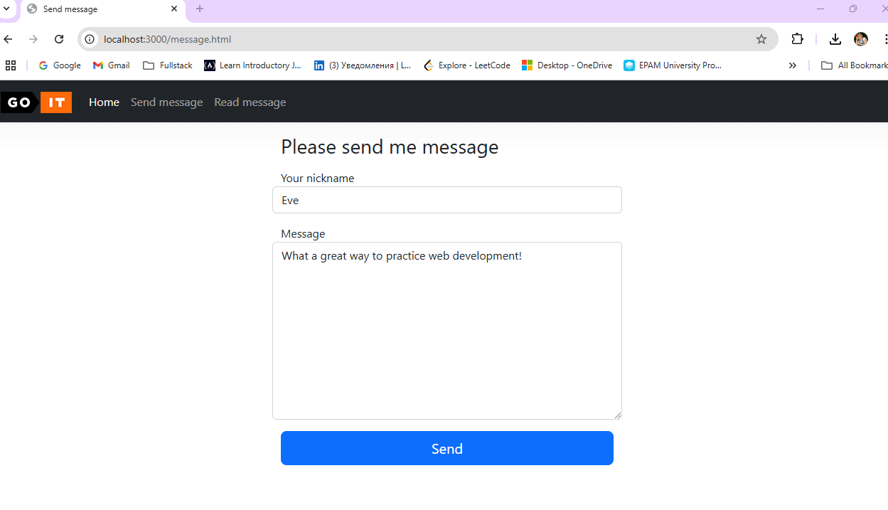
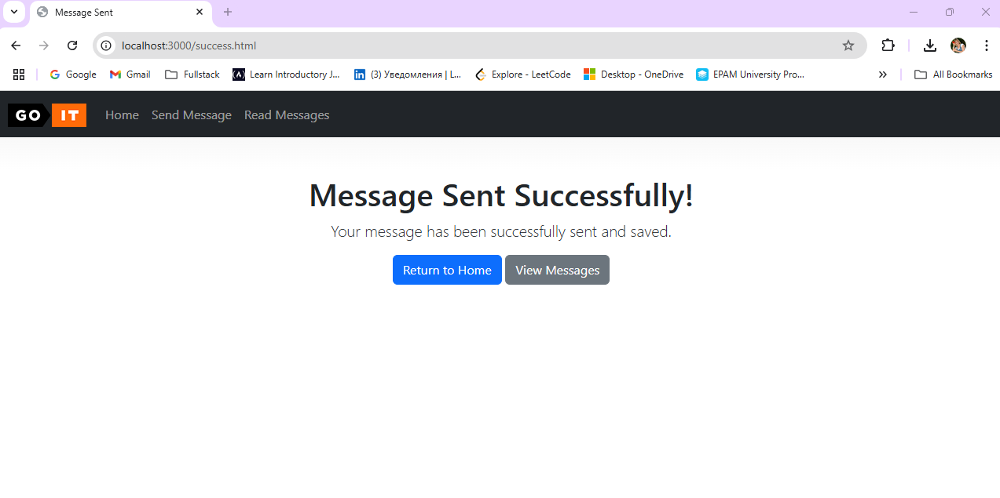
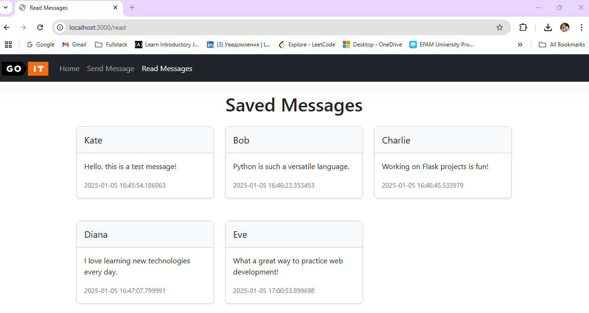
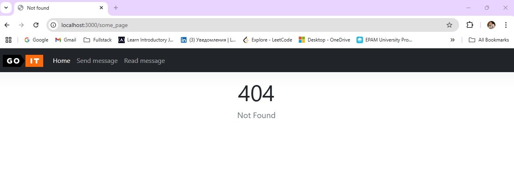
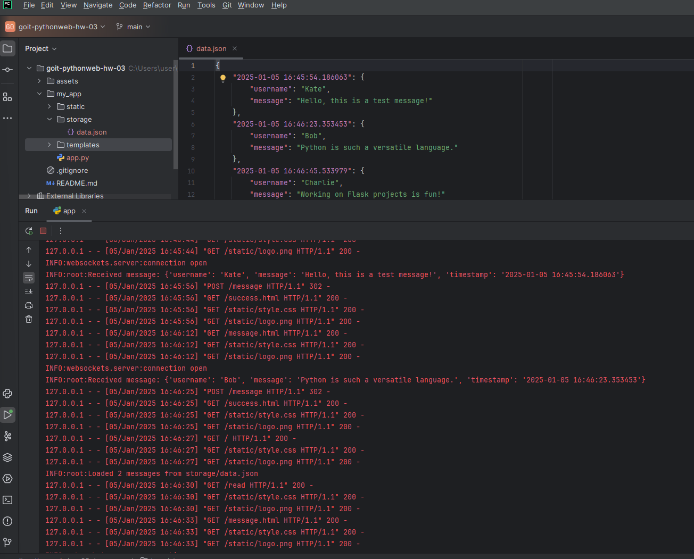
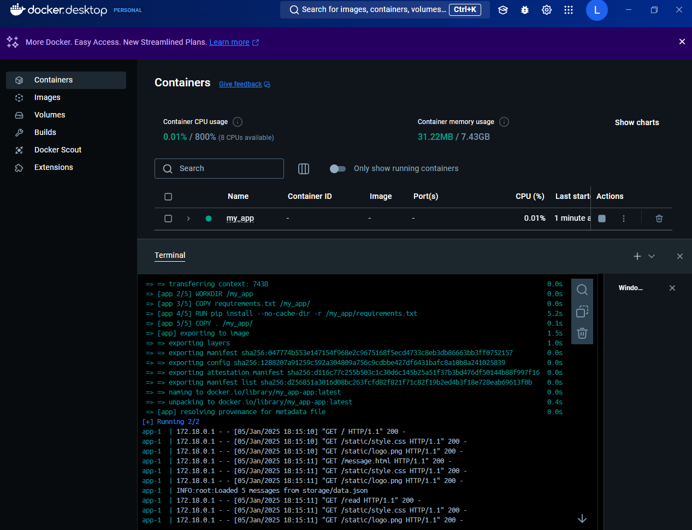

# Topic 3. Homework | Web basics | Simple HTTP server

Your goal is to implement the simplest web application. Use the following files from this repository as a base: https://github.com/GoIT-Python-Web/FullStack-Web-Development-hw3.

---

## Technical Description of the Task

Based on the example in the manual, create a web application with routing for two HTML pages: `index.html` and `message.html`.

Additionally:

- Handle static resources during the application runtime: `style.css`, `logo.png`.
- Implement functionality for the form on the `message.html` page.
- If a `404 Not Found` error occurs, return the `error.html` page.
- Your application should run on port `3000`.

---

### Working with the Form

The received byte string from the form should be converted into a dictionary and stored as a JSON file (`data.json`) in the `storage` directory.

The format for `data.json` should be as follows:

```json
{
  "2022-10-29 20:20:58.020261": {
    "username": "krabaton",
    "message": "First message"
  },
  "2022-10-29 20:21:11.812177": {
    "username": "Krabat",
    "message": "Second message"
  }
}
```
### Each Message's Key

- The key for each message should be the timestamp when the message was received (`datetime.now()`).
- Each new message from the web application should be appended to the `storage/data.json` file with the timestamp.

---

### Additional Route

- Add a `/read` route that generates an informational page.
- This page should use a Jinja2 template to display all stored messages from the `data.json` file.

---

### Additional Task (Optional)

This additional task is not required to complete the homework assignment:

1. Create a `Dockerfile` and run your application as a Docker container.
2. Use the volumes mechanism to store data from `storage/data.json` outside the container.

---

### General Requirements for Completing the Homework

Meeting these requirements is mandatory for evaluation by the mentor. If any requirement is not met, the mentor will return the homework for revision without evaluation.  
If you need clarification or are stuck on a specific step, reach out to your mentor in Slack.

---

### Main Requirements

1. **Routing**:
   - Two HTML pages are created: `index.html` and `message.html`.
   - Static resources are handled (`style.css` and `logo.png`).
   - The web application runs on port `3000`.

2. **Form Handling**:
   - The form on the `message.html` page works correctly and sends data (`username` and `message`).
   - Data from the form is converted into a dictionary and written to the `data.json` file in the following format:
     ```json
     {
       "%timestamp%": {
         "username": "example",
         "message": "example message"
       }
     }
     ```

3. **Jinja2 Template**:
   - When accessing the `/read` route, a Jinja2 template page is returned, displaying all saved messages from the `data.json` file.

4. **404 Error Handling**:
   - A `404 Not Found` error returns the `error.html` page.

5. **Message Storage**:
   - Messages are stored in the `storage/data.json` file in JSON format, with the timestamp as the key.

---

### Additional Requirements (Optional)

- Create a `Dockerfile` to run the application as a Docker container.
- Use the volumes mechanism to store the `data.json` file outside the container.

---

# TASK RESULTS

### Home_page

### Message_form_page

### Message_success

### Messages_history

### 404_page

### Server_notifications

### Docker_container_for_my_app


